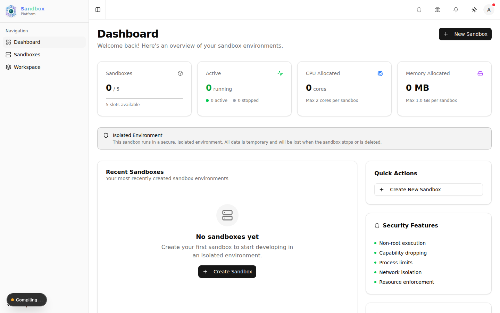
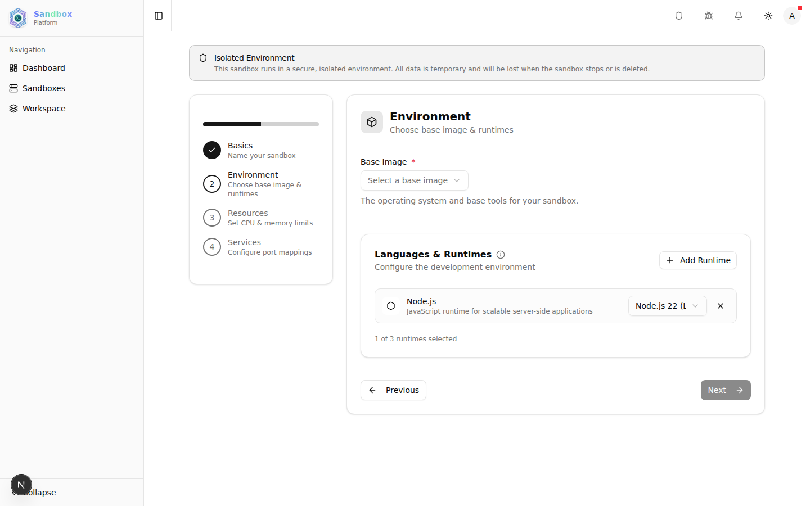
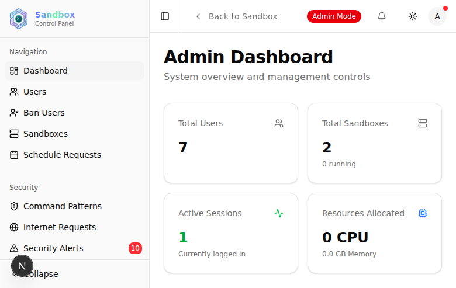
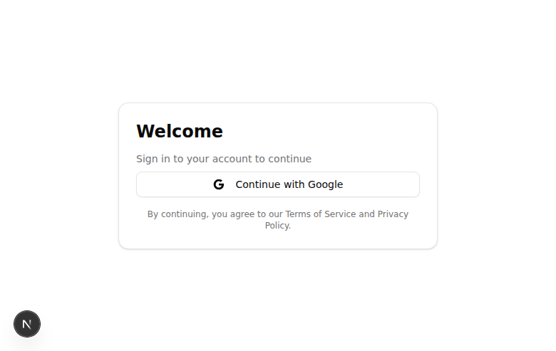

# Sandbox Platform

Docker-based isolated development environments, reachable from a browser. A user
gets a container with a shell, the runtimes they asked for, and a URL for any
service they expose — without installing anything locally, and without the host
being at risk from what they run.



## What it does

Each sandbox is a Docker container with a resource budget and a network policy.
The platform gives the person inside it a terminal over WebSocket, a file
manager, and a way to publish a port; it gives the operator limits, an audit
trail, and a say over what leaves the box.

- **Browser terminal** — a real shell over WebSocket (xterm.js), not a command form
- **Runtimes on demand** — Node.js, Python, Java, Go, Rust, PHP, Ruby, .NET, with a version per runtime
- **Resource budgets** — CPU, memory and sandbox-count limits per user, enforced by Docker
- **Exposed services** — a port inside the container becomes a URL at `/s/<service>`
- **Network control** — outbound access is a decision, not a default; requests can be approved per sandbox
- **Command filtering** — configurable patterns, with alerts when one matches
- **Scheduling** — sandboxes can start and stop on a schedule rather than idling
- **Audit trail** — commands, actions and admin decisions are logged
- **Telegram notifications** — admin alerts without watching the dashboard

## Screens

Creating a sandbox is four steps: name, environment, resources, services.



The admin side reports on the whole deployment — containers, sessions, resources
allocated — and holds the security controls.



Sign-in is OAuth for users; administrators have a separate credential login.



## Stack

| Layer | What |
|---|---|
| Framework | Next.js 16, React 19, TypeScript |
| UI | shadcn/ui, Tailwind CSS v4 |
| Database | SQLite via Drizzle ORM |
| Containers | Docker, through dockerode |
| Auth | Better Auth — Google/GitHub OAuth, plus admin credentials |
| Terminal | xterm.js over `ws` |
| Notifications | Telegram Bot API |

## Running it

Docker must be reachable — the platform creates and controls containers through
the host's Docker socket, so it needs access to it.

```bash
bun install
cp .env.example .env     # fill in the values below
bun run db:migrate
bun run dev              # Next.js on :1362 and the WebSocket server together
```

`bun run dev` starts two processes: the Next.js app and the terminal WebSocket
server. `bun run start` does the same for a built app.

### Configuration

Everything lives in `.env`; `.env.example` lists each key. The ones without a
sensible default:

| Key | Why |
|---|---|
| `BETTER_AUTH_SECRET` | Signs sessions. Generate your own. |
| `BETTER_AUTH_URL` | The origin the app is served from. |
| `GOOGLE_CLIENT_ID` / `GOOGLE_CLIENT_SECRET` | User sign-in. |
| `GITHUB_CLIENT_ID` / `GITHUB_CLIENT_SECRET` | User sign-in. |
| `ADMIN_EMAIL` / `ADMIN_DEFAULT_PASSWORD` | The first admin, created once by `/api/internal/seed-admin`. Unset, seeding refuses rather than creating a guessable account. |
| `DOCKER_SOCKET_PATH` | Defaults to `/var/run/docker.sock`. |
| `TELEGRAM_BOT_TOKEN` | Optional; admin notifications are skipped without it. |

The SQLite file is local state, not source — it is gitignored, and so is `.env`.

## Layout

```
app/          Next.js routes — user sandbox UI, admin panel, API handlers
components/   UI, built on shadcn/ui
lib/          auth, config, Docker and security logic
database/     Drizzle schema
drizzle/      generated migrations
server/       the terminal WebSocket server
```

`PROJECT_ANALYSIS.md` goes further: architecture, threat model, and the
reasoning behind the security layers.
